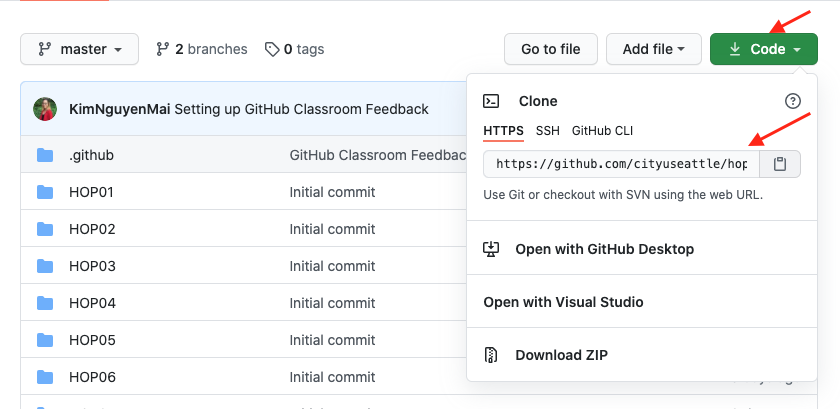

# CS570-Fall-2020

<strong>PREPARATION TO DO HANDS-ON PRACTICE </strong>

1. In your local machine, open Terminal (for Mac) or Command Propmt (for Windows), type the following commands to create a directory for this class: </li><br/>
<li>```cd Desktop``` (to change directory to Desktop)</li><br/>
<li>```mkdir CS570```(to create a directory for this course)</li><br/>
<li>```git clone <URL>```(to download this Github repository to your local machine, <strong> replace <URL> with the actual url of your repository, example below </strong>)</li><br/>
 <br/>
<li>```cd <HOP#-GithubUsername>```(to change directory to the repository you just downloaded, <strong> note that you need to replace ```<HOP#-GithubUsername>``` with the actual repository name you just downloaded </strong>) </li><br/>
<li>```git pull https://github.com/cityuseattle/CS570-Fall-2020.git``` (to get the most updated content from source repository). If you are prompted to type a message, you can skip this by typing ```:wq``` + ```Enter```</li>
2. Change directory to the corresponding folder of each week. For example: Your work for module 1 should be stored under ```Module 1``` folder; your work for module 2 should be stored under ```Module 2```, and so on:<br/>
<li>```cd Module 1```</li><br/>

3. Now, follow the instructions provided in each folder to complete your Hands-on Practice<br/>

<strong>SUBMIT YOUR WORK </strong>

Once you completed the Hands-on practice, do the following to push your work to GitHub <br/>
1. Open the terminal from the VSCode by hitting the control + ~ key, make sure you are in the right path, for example:
KimNguyen/Desktop/CS570/HOP01-KimNguyenMai/Module 1 <br/>

Type the following command: <br/>
<li>```git add .``` (to copy all changes you have made)</li><br/>
<li>```git commit -m “Submission for Module 1”``` (To add a message to your submission)</li><br/>
<li>```git push origin master``` (to upload your work to Github) </li><br/>


2. Create a pull request <br/>
Go to the remote repository in GitHub <br/>
Create a pull request<br/>
